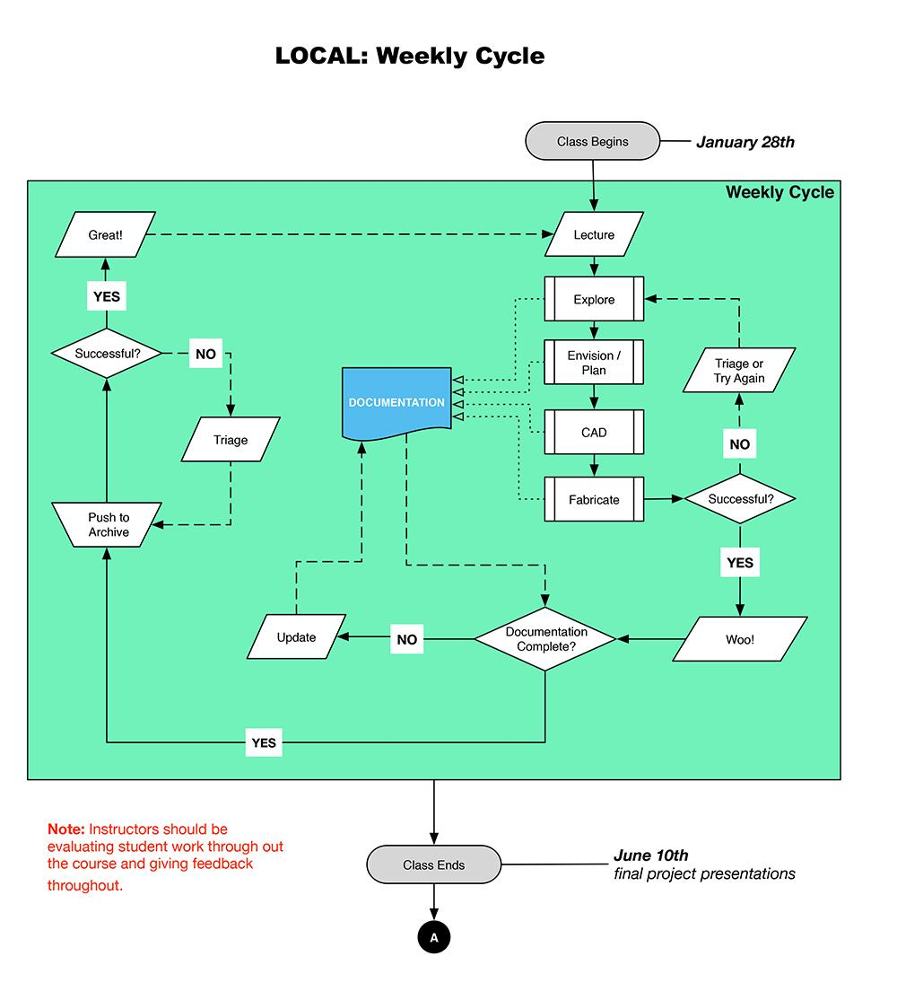
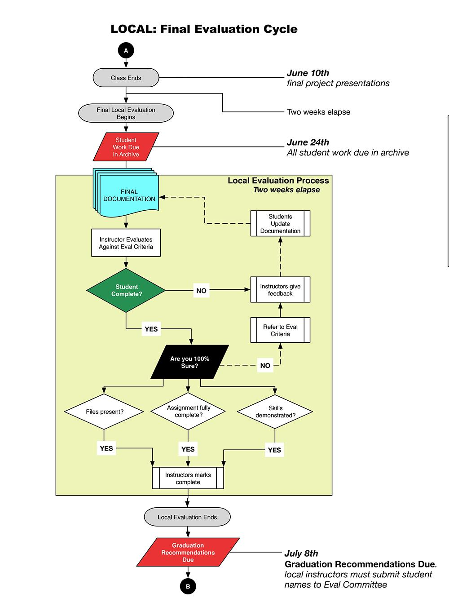
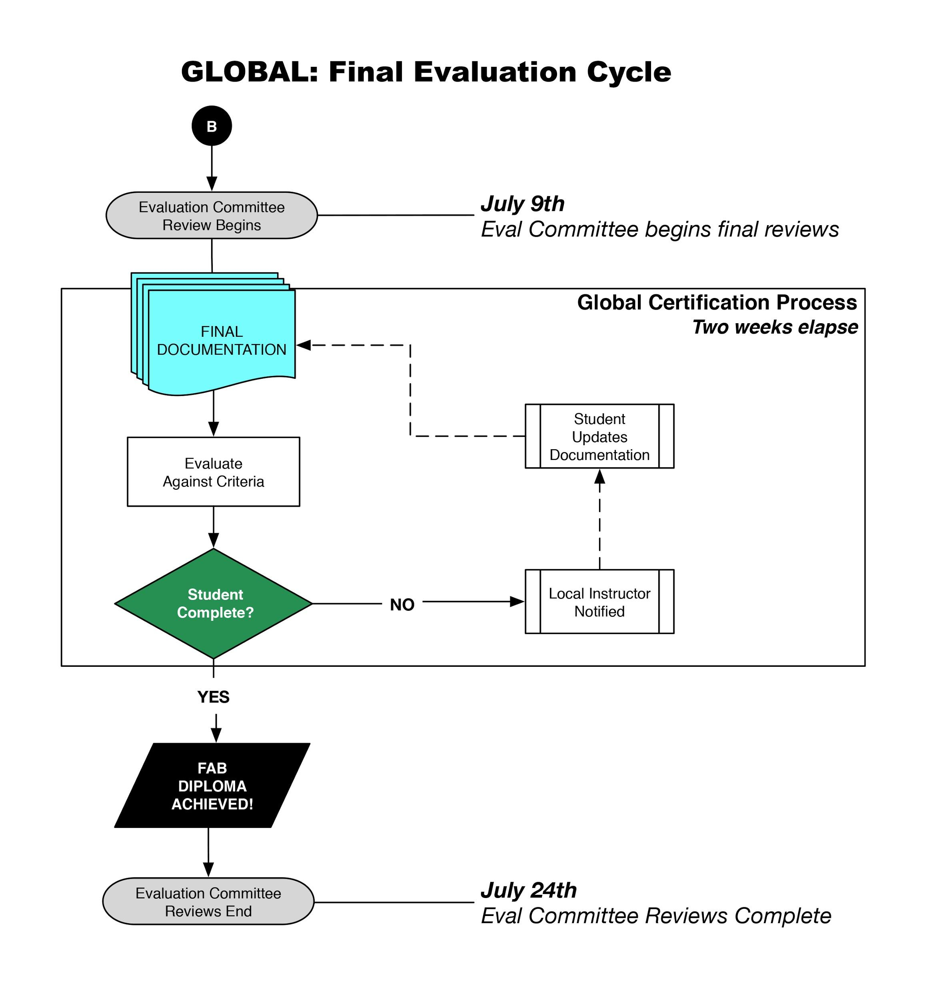

**The Fab Academy Handbook **

A resource for Students, Local Instructors, New (and Old) Labs and Gurus alike

**_Rev.1.2 - _***2016*

**Table of Contents**

# Introduction

The role of [Fab Academy](http://www.fabacademy.org/) is to initiate, mentor and technically train new students for participation and leadership in the global Fab Lab Network community. It’s how we train our teachers.

It’s also a great way to gain exposure to a wide variety of digital fabrication, electronics, molding and casting and composites practices and build skills in a short amount of time (typically 19 weeks). It’s not for the faint of heart (see the course requirements and 2016 schedule), but the rewards are great.

This document is written for those interested and/or participating the Fab Academy (both current and aspiring students and labs). It assumes that you already know what a Fab Lab is - and that you already have one or are in the process of setting one up.

### What’s a Fab Lab?

If you have stumbled across this document via search and do not know what a Fab Lab is - or you want to set up your own Fab Lab - please see these [Fab Foundation](http://www.fabfoundation.org/) resources:

* [What are Fab Labs?](http://www.fabfoundation.org/fab-labs/)

* [Setting up a Fab Lab](http://www.fabfoundation.org/fab-labs/setting-up-a-fab-lab/)

* [Official Fab Lab FAQ](http://fab.cba.mit.edu/about/faq/)

* [Detailed info about labs around the world](https://www.fablabs.io)

# New and Aspiring Labs: Basic Requirements

##
Basic Requirements for Fab Academy Participation

Here are the basic requirements and expectations for any lab that wishes to participate in the the Fab Academy course.

Your lab MUST be equipped with the ALL necessary digital fabrication machines, electronics components and other supplies to be able to participate in the Academy. Labs that are not properly equipped are not eligible to participate in the Academy, as the students will not be able to complete the course.

As this is a bleeding edge program, hardware and electronics specification is continually being updated. For the most up-to-date list of recommended machines and supplies, see: [the Fab Lab Inventory ](http://fab.cba.mit.edu/about/fab/inv.html)

## Necessary Machine Types

* A computer-controlled laser cutter, for press-fit assembly of 3D structures from 2D parts.

* A large (4'x8') numerically-controlled milling machine, for making furniture (and larger) sized parts.

* A vinyl cutter, to produce printing masks, flexible circuits, and antennas.

* A desktop sized precision (micron resolution) milling machine to make three-dimensional molds and surface-mount circuit boards.

* Specific machine models (thoroughly tested and highly recommended but not required) are listed in [the Fab Lab Inventory ](http://fab.cba.mit.edu/about/fab/inv.html)

## Necessary Supplies

* Programming tools for low-cost high-speed embedded processors

* Course-required surface mount electronics components

* FR1 stock for machining circuit boards

* Molding and casting supplies

* Composites supplies

* Cardboard, sheet plywood and other consumable stock materials

Some of the hard to find materials are going to be made available in kit form (for a fee) during the course. Suggested lead time is 2 weeks in most places (allow for longer in remote locations) and reminders of what is needed within this 2 week window will be made during weekly prep meetings.

### Do I need these specific machines and electronic components?

Yes - you do.

In order to fully participate in the class you will need the electronics components and other supplies. Do not skimp on the electronics, about half the course utilizes these components.

In some rare cases, non-Fab Lab Inventory machines may be substituted, but this often causes serious problems for the students as the Academy Gurus are unable to support the unfamiliar machines remotely when things go wrong.

We recommend the machines in the inventory for a reason, we have found them to be reliable, affordable and able to perform the necessary course tasks. Other machine will be considered on a case-by-case basis if your lab applies to be a Fab Academy site (Node) .

It also violates the core Fab principle that "Fab labs share core capabilities, so that people and projects can be shared across them." - Neil Gershenfeld, [Fab Lab FAQ](http://fab.cba.mit.edu/about/faq/)

## Local Class Working Groups

### What is the maximum / minimum number of students in a local Fab Academy class?

Beyond a Local Instructor, a workgroup of students is required in order to create the necessary collaboration environment for a successful Fab Academy class.

We have found that it is (nearly) impossible for a student to complete the course on their own and workgroup ensures that one student’s strong suit may help make up for another student’s weak spots and vice versa.

**Here are the general guidelines for Class Working Groups:**

* CRITICAL MASS NECESSARY: They are made up of a Local Instructor and at least 3 students or 3+ students and a Remote Guru.

* PREVENTING INSTRUCTOR OVERLOAD: Groups larger than approximately 10 students per Local Instructor or Guru are not recommended, simply because there are not enough hours in the weekly cycle for each of those students to receive appropriate guidance from a single individual.

* MACHINE LOGISTICS: In the case of multiple Local Instructors / Gurus in one lab, another 5 students can be enrolled for a recommended maximum of 15 students, as the problem now becomes a logistical one of students vs machines and machine time available (assuming standard inventory quantities).

* REMOTE LOCATION CONSOLIDATION: Likewise, it is not recommended that Guru support more than 10 remote students and every attempt should be made to group remote students in such a way that Gurus do not have students in more than 2 remote locations.   

# Basic Fab Academy Course Info

## 2016 Weekly Schedule and Topics Covered

Subject to change: see [http://archive.fabacademy.org/archives/2016/master/schedule.html](http://archive.fabacademy.org/archives/2016/master/schedule.html)

## Class Meeting Times

Global lectures happen on Wednesdays at 9:00 AM EST (ranging from 6:00 on the West Coast to 23:00 in Japan) and last for approximately 3 hours. Recitations will be held on Mondays 9:00 AM EST, and regional reviews on Tuesday.

Refer to the current schedule for detailed information.

Local Instructors and Gurus are also required to attend the weekly prep meeting on Wednesdays 8:30 AM EST, 30 minutes** **before the start of class.

## Weekly Homework Reviews / Help Sessions (Experiential 2016)

Homework review sessions led by Gurus will be staggered according to global time. Exact time will be confirmed by the SN Gurus.

All sessions take place on the MCU conferencing system on channel 4 - Class. More information on this in the section below entitled "Video Conferencing".

Due to the limited number of MCU connections, students must go to their lab to participate with their local working group.

## **Students: Basic Course Requirements**

### Student Time Commitment

The time commitment is about 16+ hours a week at minimum, but could be far greater if the student is highly motivated, does not possess the background for a particular unit (or units) or just wants to really throw themselves into the program.

### Required Documentation

Students are required to document their work each week for the unit covered and homework will be reviewed during each weekly class cycle. Your local instructor or remote guru will review your documentation in detail every four weeks to make sure you are not falling behind.

Your Fab Academy documentation must show completion of the unit and core skill competencies. It will be in HTML format and must be able to exist within a GIT archive.

At minimum, the Global Evaluation Committee expects a student’s documentation to include:

* A text description of their project for the week

    * designing and fabricating the work

* Supporting photographs (video is great, but not required).

* All final fabrication files in their original, editable formats

* All code in an editable format, testable format

* What the student learned: what succeeded and what failed.

It is recommended that students choose a licence for their work prior to the start of publicly posting their files. ie: [Creative Commons](https://creativecommons.org)

### Sharing Digital Files and Code

You must share all of your digital design files and code (where applicable) to pass the unit.

### Student Rights and Expectations

**You have the right to expect: **

* Access to working and well-maintained digital fabrication machines in your local lab.

* That all the necessary course materials will be provided for you by the local lab before the necessary unit.

    *  This includes sheet goods, molding and casting supplies and electronics components.

* Meeting at least three times a week with your local instructor.

    * Two meetings are devoted to hands-on machine instruction, general lab access and direct physical access to the local instructor for questions, tutoring, etc.

    * The third session each week is devoted to Wednesday’s lecture session with Neil Gershenfeld.

* That your local instructor / remote guru will be available to answer questions via email during the week - outside of class.

* That your local instructor will give you meaningful feedback on your work and documentation. If your documentation is unsatisfactory, the Local Instructor will help you to get it up to par.

**If you have a Remote Guru assigned, you should expect that:**

* the Guru will contact you to set up a mutually agreed upon weekly video check-in session to help you with any questions you may have.

### Student Responsibilities

It is your responsibility to be proactive in the Fab Academy course. This course offers a great deal of personal freedom.

However you are responsible for:

* Designing and fabricating your own projects

    * It’s fine to begin with someone else’s files, but it is not acceptable to pass someone else’s work off as your own.

    * Cite all your sources and inspirations.

* Getting your work done on time for each weekly cycle.

* Documenting your work in HTML

* Ensuring that your documentation is in the class archive. Work that is not in the archive will not be evaluated.

# Academy Roles and Key Personnel

## Fab Academy Staff and Contacts

Below are the contacts and roles of some of people which you may need to get in touch with throughout the course.  

**Prof. Neil Gershenfeld**

Fab Academy Program Director

[instruct@fabacademy.org](mailto:instruct@fabacademy.org)

**Sherry Lassiter**

Director Fab Lab Program and Fab Foundation

[sherry@fabfoundation.org](mailto:sherry@fabfoundation.org)

**Tomas Diez**

Fab Academy Global Coordinator

[coordination@fabacademy.org](mailto:coordination@fabacademy.org)

**Luciana Asinari**

Fab Academy Admission Office

[luciana.asinari@iaac.net](mailto:luciana.asinari@iaac.net)

**Fiore Basile**

Fab Academy Developer and IT Guru

[it@fabacademy.org](mailto:it@fabacademy.org)

**Supply Chain:
**

US, South America or Asia:** **please contact Jean-Luc Pierite directly at:** ****[jeanluc.pierite at fabfoundation.or**g](mailto:jeanluc.pierite@fabfoundation.org)** **

**Europe, the Middle East or Africa:** Fab Lab Barcelona also manages stock for the Fab Foundation. To order from them please email: **[orders at fablabbcn.or**g](mailto:orders@fablabbcn.org)

## What Are "Gurus"?

Fab Academy graduates who have shown mastery of the broad range of HTMAA and have earned the respect of their peers through their[ years of service](#bookmark=kix.eaycmcwtyl9o) to the Academy.

The role of Fab Academy Guru is to initiate, mentor and technically train new Fab Academy students for participation and leadership in the global Fab Lab Network community.

As many students are without strong local mentorship, the Guru’s key task is to monitor the students or labs placed in their charge - clearly communicating both class expectations, answering their questions, supporting them (through both email and video conferencing) and monitoring and tracking their progress and attendance.   

Gurus may be Local Instructors or they may be physically located elsewhere and function as a Remote Guru for another lab.

### Guru Responsibilities

It is the Guru’s responsibility to work with their assigned students and the local lab they mentor to verify that both equipment and supplies are available to the students in time for weekly assignments.  

While a Guru’s primary role is to keep a lab accountable and students "on task", Gurus are also cheerleaders, and at all times should provide moral support and motivation to struggling or overwhelmed students.

### On Guru-ing

Being a Fab Guru is more of an art than a science. Like each student, Gurus have very different backgrounds and each has their own style, interests and "experiential wisdom" to transmit to students.

There is no "single right way" to Guru - student’s skills, software choices and project aspirations will all be very different. A Guru’s duty is to mentor students on the Fab Academy Path, imparting wisdom that will help them successfully complete the course.

### "I Don’t Know, but I’ll Find Out" is an Acceptable Answer!

Gurus teach "How to Make Almost Anything". It’s a team effort, no one knows every facet of every area. Gurus often work as a team, using other instructors as resources.

## Current Active Fab Academy Gurus

* **Bas Withagen**

    * Specialties, what I like to make, role, ask me about…...

* **Shawn Wallace**

    * Specialties, what I like to make, role, ask me about…...

* **Mercedes Mane**

    * Specialties, what I like to make, role, ask me about…...

* **[Luciano Betold**i](mailto:luciano@fablabbcn.org)

    * Furniture Design - Complex Joints

    * Molding and Casting

    * Composites

    * CAD Design

    * CNC Machining

* **Alex Schaub**

    * Specialties, what I like to make, role, ask me about…...

* **Tomas Diez**

    * Specialties, what I like to make, role, ask me about…...

* **[Nuria Roble**s](mailto:nuriafablab@gmail.com)

    * Specialties, what I like to make, role, ask me about…...

* **Francisco**

    * Antimony

    * Kokopelli

    * Assembly

    * attiny’s

* **[Ted Hun**g](mailto:ted@fablabtaipei.org)

    * Specialties, what I like to make, role, ask me about…...

* **Fiore**

    * Fab Modules

* **Ohad**

    * Specialties, what I like to make, role, ask me about…...

* **Blair**

    * Specialties, what I like to make, role, ask me about…...

* **[Ben**o](mailto:beno@fablablima.org)

    * Final Project suggestions

* **[Aldo Sollazz**o](http://noumena.io/)

    * **Computational design**

    * **Grasshopper**

    * **Python**

* **Etc (Gurus - you know who you are, add yourself here)**

# Distinctions Between Gurus and Local Instructors

As the network grows we have found it necessary to further distinguish between those with experience teaching Fab Academy and those who are just starting out.

## What Denotes a Guru?

A Guru is a senior instructor. Gurus have 3 or more years of Academy teaching experience, making them qualified to take on students without direct supervision.

## Who Can Be a Fab Academy Local Instructor?

The first requirement for becoming a Fab Academy Local Instructor is to complete the Fab Academy program satisfactorily.

### Year 1: Local Instructor with Mandatory Support and Supervision

* Fab Academy graduates (with the recommendation of their instructor or remote Guru) are eligible to be local Fab Academy Local Instructors.

* They must have the help of a remote Guru and / or supernode support during their first year.

### Year 2+: Stand Alone Local Instructor

* Second and third year instructors are eligible to be local Local Instructors (with the recommendation of their supernode / remote Guru) without direct remote supervision.

## Video Conferencing

### Necessary Hardware / Connectivity

* Internet access (recommended at least 1MB upload/download speed)

* Webcam (or one built into your computer)

* Noise canceling microphone (or headphones with a built-in mic for individuals)

**A noise cancelling speakerphone** is recommended when connecting through a computer as a group for class (as opposed to a Polycom system). We currently [recommend this speakerphone](http://business.logitech.com/en-us/product/mobile-speakerphone-p710e-business), but see the [Fab Lab Inventory](http://fab.cba.mit.edu/about/fab/inv.html) for the latest recommendation.

### Class Location (MCU / MCUC)

All classes and most meetings will take place on the CBA MCU.

* The address of the MCU is 18.85.8.48

* The address of the MCUC is 18.85.8.50

* Fab Academy Lectures are held in room 4 "Class" (4@18.85.8.48, 4@18.85.8.50).

* The PINs are distributed via the [Instruct Mailing List](http://lists.fabcloud.io/cgi-bin/mailman/listinfo/instruct).

### Recommended Software

The CBA maintains a [detailed list of compatible video conferencing clients](http://fab.cba.mit.edu/about/video/) and MCU technical connection details.

An up-to-date tutorial on connecting to the MCU using Linphone from an Ubuntu installation can be found [here](http://beachlab.org/fab2016/video.html).

Since the previous recommended application for Mac and Windows is no longer supported (Jabber Video) we have created a quick tutorial meant only as a stop-gap measure until a better long term solution is found. Please find it [here](http://fabulabu.github.io).

**NOTE: You may want to connect to 1@18.85.8.48 to test your audio and video.** "1" is the general Fab Lab channel and there are usually several labs connected that can help you test your audio and video.

### Here’s what a MCU is and how it works:

"Simultaneous videoconferencing among three or more remote points is possible by means of a Multipoint Control Unit (MCU). This is a bridge that interconnects calls from several sources (in a similar way to the audio conference call)."  - [Wikipedia Entry](http://en.wikipedia.org/wiki/Videoconferencing#Multipoint_videoconferencing)

This means that you can talk directly to all the other participants, including Professor Neil Gershenfeld, and ask questions during our Wednesday lecture sessions.

### Video Conferencing Etiquette - IMPORTANT!

Because everyone connected to the MCU can hear each other, it is vital that you mute your microphone when joining a conference and UN-MUTE ONLY WHEN SPEAKING. [See video for how to do this](http://youtu.be/cIdom9a9dCg).

Failure to mute will cause a disruptive feedback echo that will SERIOUSLY interfere with the audio quality, making class unpleasant.. Neil can see who is the source of the problem and will mute you, so failure to mute is potentially embarrassing. Practice connecting prior to class.

**Since last year, we have set the default to mute as you join. **This means that you will be required to unmute yourself not only on your local system (usually by clicking a microphone logo) but also on the MCU bridge before anyone can hear you. To do this, use the keypad in your Polycom remote or software application to** ****input the number 6 followed by an asterisk (*).**

Similarly, make sure that your camera is on and that all class participants are visible (if possible). Light the participants from the camera side and eliminate back lighting as much as possible, so everyone connected can see you.    

## Email Lists

As previously noted with regards to video conferencing, etiquette should also be observed in email conversations. Several email lists exist in order to make communication between the different groups within the Fab Academy structure easier and more organised.

**class[year]@fabacademy.org**

This is an email alias shared by all current Fab Academy students. [class14@fabacademy.org](mailto:class14@fabacademy.org) is for the 2014 class, [class15@fabacademy.org](mailto:class15@fabacademy.org) for 2015, etc.

**instruct@fabacademy.org**

This is an email alias shared by all current Fab Academy Instructors.

**globaleval@fabacademy.org**

This is the email alias for the Global Evaluation Committee tasked with grading.

**alumni@fabacademy.org**

This is an email alias onto which all graduates are entered upon completing Fab Academy.

**Add Youself**

If would like to be added to any of these lists please manage your subscription [here](http://lists.fabcloud.io/cgi-bin/mailman/options/instruct). Remember that the instruct list is only for Instructors, Gurus and Staff so while you may add yourself to the list you will not be approved if you are not one of the above. Same applies to global eval etc.

**Email List Etiquette**

The following email lists are high-volume lists. Students should first discuss their issue with their Local Instructor or Remote Guru if possible.

**Custom Email Lists**

As an instructor or supernode Guru you may also choose to create your own alias in order to facilitate internal communication between your student’s (remote and local) and even yourself or your staff. i.e.: academy@fabLabbcn.org

# Accepted Academy

#  Sites: Getting Started

## Basic Lab Expectations

* The "[Basic Requirements](#bookmark=id.imk0es7smkg0)" have already been met

* There is a Local Instructor present or a Remote [Guru](#bookmark=kix.f7nkxpzgzrwp) has been assigned

* If the [Local Instructor](#bookmark=kix.x7z99qjalgie) is new (first year as an instructor), they are officially assigned to and being mentored by a Remote Guru.

* Local instructors will attend prep meetings each week at 08:30 EST

* [Local Working Groups](#bookmark=id.s5ck7t5p3r0l) (comprised of students and instructors) will attend lecture together from the local lab every Wednesday at 09:00 EST and recitations on Mondays 09:00 EST.

### Class Participation: Internet Access

The Fab Academy meets as a class for lecture, homework review and other meetings via videoconference.  You must have a reliable internet connection to participate.

* For connectivity requirements see the [Video Conferencing](#bookmark=kix.2ye0c7enqpuy) section.  

* For class meeting times see [Basic Course Info](#bookmark=id.jmdofkefd8yy) section.

## New Lab Checklist: Complete These Tasks Prior to 1st Class

* Your lab has all the [digital fabrication machines](#bookmark=id.lcjng2i3yhwo) set up and ready for immediate student use.

* You have ordered (or are working with the Fab Foundation to order) all the [necessary course materials](#bookmark=id.843gxx6uvm3c).

* Your lab meets the [Video Conferencing](#bookmark=kix.2ye0c7enqpuy) requirements AND your lab has "test connected" to the MCU PRIOR TO CLASS to ensure that:

    * your network can handle the bandwidth required

    * you have the necessary hardware

    * understand how to mute your microphone

    * we have a pleasant and trouble-free first class ;-)

* **["How to Connect" to the MCU Quickstar**t](#bookmark=id.mk508xls9w6j)

* Your lab’s Local Instructor is on the instructor list. If you have not been receiving emails, you are not on the list. Contact [Fab Academy Coordination](#bookmark=id.z8n6ar5cvuw9)

* You have clearly communicated your student’s email addresses to [Fab Academy Coordination](#bookmark=id.z8n6ar5cvuw9) so your students have been added to the "Class" email list.

## New Remote Guru Checklist: Prior to 1st Class

Complete the tasks on the the "[New Lab Checklist](#bookmark=id.qruwpi8b9gl)" above - PLUS You have arranged a mutually agreed upon WEEKLY MEETING TIME with your remote students to go over homework. problems, etc.

# Local Instructor and Remote Guru Responsibilities and Requirements

## Instructor Prep Meetings

In addition, we will meet as instructors each week, it is vital that you attend every prep meeting.

## Weekly Time Commitment: Local Instructors

Local Instructors should commit to a **minimum of 16 weekly hours** on their duties during the Fab Academy program (January to June) divided into the following categories and based on a class of ~5 students:

* Prep meeting and Neil’s Lecture	**(3.5h)**

* Homework Review			**(1.5h)**

* Student support hours		**(6h-8h minimum)**

* Grading				**(1h)**

* Stock control and ordering		**(2h)**

## Weekly Time Commitment: Remote Gurus

Remote Gurus working with labs without a local instructor should expect to spend **a minimum of 6 weekly hours** on their duties.

1-2 weekly hours per remote student, attend lecture and prep meetings and may need to take on additional tasks - depending on their agreement with the local lab and the level of help needed.  

* Prep meeting and Neil’s Lecture	**(3.5h)**

* Homework Review			**(1.5h)**

* Remote student support hours	**(1h-2h per student)**

Remote Gurus are REQUIRED to meet with their mentee lab / students for a video check-in session each week. This is vital to the success of remote students. **
**

**Possible Guru Tasks (no local instructor)**

* Grading				**(1h)**

* Stock control and ordering		**(2h)**

## Weekly Time Commitment: Remote Supervision

Depending on the experience level of the local tutor, a remote Guru may be asked to simply supervise a lab to ensure that the local instructor is keeping up with his weekly duties by checking in with him over email or weekly quick call, as well as to check on student progress.

This should take no more than 4 hours a week for a group of around 15 students.  

## Time Commitment: Final Student Evaluations

During the final grading at the end of the class - which determines if a student has graduated - Local Instructors and Remote Gurus should expect to spend approximately 6-8 hours reviewing their student’s work BEFORE submitting those they believe to have completed all assignments and final project successfully to the Global Evaluation Committee.

Senior Instructors (2+ years experience and have completed at least one grading cycle on their own are required to serve on the Global Evaluation Committee to help out with the final student review process. The number of enrolled students continues to grow and many hands make light work (and decrease the individual time commitment).

## Application Process: Screening Students.

Local instructors need to interview and inform their prospective students. It is the Local Instructor’s responsibility to ensure that incoming students understand the course’s time (**16+ hours a week minimum**), [participation and documentation requirements](#bookmark=kix.shzkhj462x0o), as well as the grading benchmarks used for evaluation.

## Supply Chain: Stocking and Ordering

The continually updated [Fab Lab Inventory](https://docs.google.com/spreadsheet/pub?key=0AtIlZyLn99e6dGRleUJTY043a3FucUhFUVVBYTdxS3c&single=true&gid=0&output=html) specifies the current list of [required materials and machines](#bookmark=id.843gxx6uvm3c). While some of the vendors listed are worldwide distributors, others are US only. This is noted in the inventory.

Announcements regarding changes in inventory or new items are sometimes made during the weekly prep meetings. **Local Instructors are responsible for ordering supplies for their students **and should leave some extra funds in the budget to account for new items being introduced during the course.

Local ordering for the Fab Academy program (especially for [Specialty Items](#bookmark=id.qnicb3u7xhta)) should ideally be made in it’s entirety ahead of the start of the course. However, this is not always possible. It is then of the utmost importance to keep track of upcoming assignments and have items in stock and on premises at least 4 weeks in advance to when they will be needed, minimising the impact of possible shipping delays.

Some of the items we use are sometimes difficult to obtain in certain countries and this advanced purchasing timeframe is essential to ensure students are able to complete assignments on time.

### Ordering Specialty Items: FR1 & Micro-Endmills, MTM(m) Stages

Some specialty items are difficult to find in small quantities, **specifically, FR1 stock and micro-resolution endmills **used for all of the electronics units.

[The Fab Foundation](http://fabfoundation.org) buys these items in bulk and can provide small quantities and at cost value to all participating labs.

* **US, South America or Asia: **please contact Jean-Luc Pierite directly at:** ****[jeanluc.pierite at fabfoundation.or**g](mailto:jeanluc.pierite@fabfoundation.org)

* **Europe, the Middle East or Africa**: Fab Lab Barcelona also manages stock for the Fab Foundation. To order from them please email: **[orders at fablabbcn.or**g](mailto:orders@fablabbcn.org)

## GIT Repositories

Local Instructors are responsible not only for teaching their students how to use the GIT repository correctly, but also for fixing any trouble their students may cause to it.

While this is part of the learning process for both Local Instructors and students, you may choose, at least at first, to use an intermediate repository that students push to and which the Instructor manually syncs weekly to the main repository.

## Managing Final Projects

Local Instructors also help students manage their time and provide guidance towards the creation of feasible final projects that can be accomplished by each student (students have different skill sets) within the duration of the course.

Local instructors and Remote Gurus must work with the students to ensure they have everything in stock, or that they order well enough in advance. You must also leave a little room in the budget for final project supplies.

**Your project must:**

* be your own design

* include an input device and an output device and two other digital fabrication processes

* include 2D and 3D design

* have a mechanical design aspect

* have a license and a plan for distribution

* fabricate, assemble and program a microcontroller board

* all files must be linked and available:

    * bill of materials (BOM), preferably with part numbers

    * electronics design files (Eagle/Image/.cad/kokopelli - whatever used)

    * code

    * fabrication files

## Group Final Projects:

Must show clearly "decomposable" tasks for each student.

This means, each student must complete a complete system that demonstrates that they individually completed all of the final project minimum requirements listed above.

## Final Project Budget: Ideally $10+ , not $100+  (whatever Neil said in class)

(make parts - where possible - instead of buying)

# Grading and Final Evaluation Schedule

## Evaluation Schedule

Local Instructors should be evaluating student work periodically throughout the course. A bi-weekly review is good, a weekly review with the student is ideal.

Instructors must review each student’s work according to the documentation provided by the student, NOT what was observed in the lab. Instructors should discuss incomplete work / documentation with a student on an ongoing basis. There should be no surprises at the end of the course.

In order to complete the program students need to satisfactorily complete *all *assignments and their final project.

**_Please keep in mind that these diagrams were designed last year and as so, the dates on them may not be current in some cases, yet the flow and logic remains. We will update them as soon as possible but please ignore the actual dates. _**

### Complete Evaluation Life Cycle: Diagram

### Local Weekly Evaluation Cycle: Diagram

## Local Final Evaluation Cycle: Diagram

## Global Final Evaluation Cycle: Diagram

## Global Evaluation Committee

Members of the global evaluation committee will each spend additional 10-20 hours making the final decision on graduation.   

### **Volunteer - Help Us Out!**

Have you been an instructor in the Academy for two or more years? Will you have completed one grading cycle as an instructor by July 2016?

If so - we need you! Academy enrollment grows exponentially every year. Many hands make light work.

If you'd like to volunteer, email [globaleval at fabacademy.org](mailto:globaleval@fabacademy.org) with the **subject heading "Eval Committee Volunteer"** and note labs and years as an instructor.

## How to Contact the Committee for Re-Evaluation

I realize that there are a few of you (or your students) that were missed or slipped through the cracks during the last round.

*Any instructor who has a student that needs to be re-evaluated from a previous year should:*

1. Review the student’s work themselves first

2. If the student is complete, contact the global evaluation committee on the email address above.

3. Use the *email subject heading*** "Re-Evaluation Requested: STUDENT NAME"**

4. Then the committee will review and determine final graduation status

**Use of consistent subject headings **will help us sort and filter our huge piles of email much more easily and** enable us to more quickly address your situation. **We truly want to get last year's limbo graduation decisions resolved.

## Why Re-Evaluation Backlogs Happen

The Evaluation Committee members are **volunteering large amounts of their time** to review student work - after teaching the Academy all semester. Please keep this in mind.

# Fab Academy Evaluation Criteria

**Draft** evaluation criteria here (please check this document each week). Minor changes will be made to this document during Fab Academy, but changes to assessment requirements will only be made to future assignments, not completed assignments.

[https://docs.google.com/document/d/1zAWJiWkeQLfKYBh_vMmz1n4kAwyFWOgF-MGMqIPLSMOo/edit?usp=sharing](https://docs.google.com/document/d/1zAWJiWkeQLfKYBh_Mmz1n4kAwyFWOgF-MGMqIPLSMOo/edit?usp=sharing)
