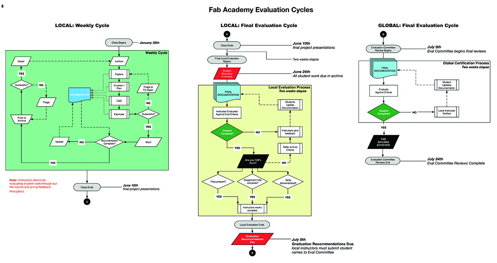

# Grading and Final Evaluation

## Evaluation Schedule

Local Instructors should be evaluating student work periodically throughout the course. A bi-weekly review is good, a weekly review with the student is ideal.

Instructors must review each student’s work according to the documentation provided by the student, NOT what was observed in the lab. Instructors should discuss incomplete work / documentation with a student on an ongoing basis. There should be no surprises at the end of the course.

In order to complete the program students need to satisfactorily complete *all *assignments and their final project.

**_Please keep in mind that these diagrams were designed last year and as so, the dates on them may not be current in some cases, yet the flow and logic remains. We will update them as soon as possible but please ignore the actual dates. _**

### Complete Evaluation Life Cycle: Diagram

### Local Weekly Evaluation Cycle: Diagram

## Local Final Evaluation Cycle: Diagram

## Global Final Evaluation Cycle: Diagram

## Global Evaluation Committee

Members of the global evaluation committee will each spend additional 10-20 hours making the final decision on graduation.   

> ### Apply for Global Eval - Help Us Out!

> Have you been an instructor in the Academy for two or more years? Will you have completed one grading cycle as an instructor by the end of the current cycle?

> If so - we need you! Academy enrollment grows exponentially every year. Many hands make light work.

> If you'd like to apply, email [globaleval at fabacademy.org](mailto:globaleval@fabacademy.org) with the subject heading `Eval Committee Application` and note labs and years as an instructor.

## How to Contact the Committee for Re-Evaluation

There are a few of you (or your students) that were missed or slipped through the cracks during the last round.

*Any instructor who has a student that needs to be re-evaluated from a previous year should:*

1. Review the student’s work themselves first

2. If the student is complete, contact the Fab Academy Coordination who will inform about the deadlines, fees and procedure.

3. Then the committee will review and determine final graduation status

## Why Re-Evaluation Backlogs Happen

The Evaluation Committee members are **dedicating large amounts of their time** to review student work - after teaching the Academy all semester. Please keep this in mind.

# Fab Academy Evaluation Criteria

Evaluation criteria below. Minor changes to future assignments will be made to this document during Fab Academy, so please check this document each week.

<http://docs.academany.org/FabAcademy-Assessment/_book/>
